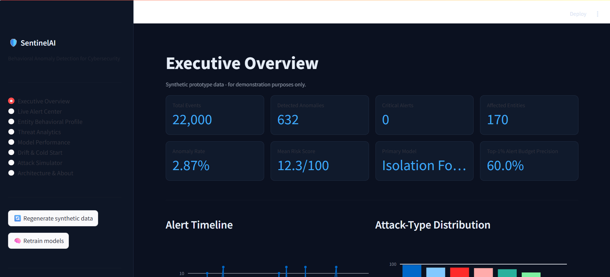
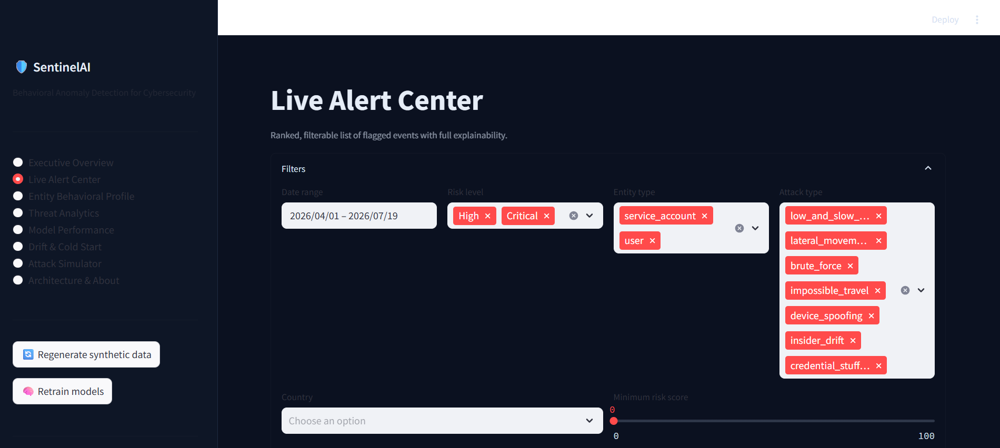
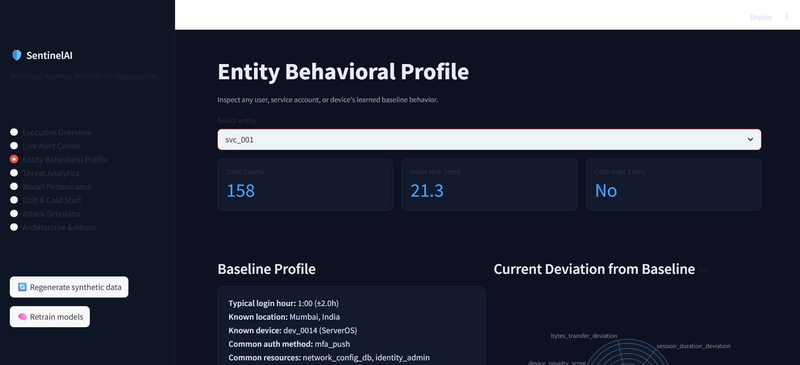
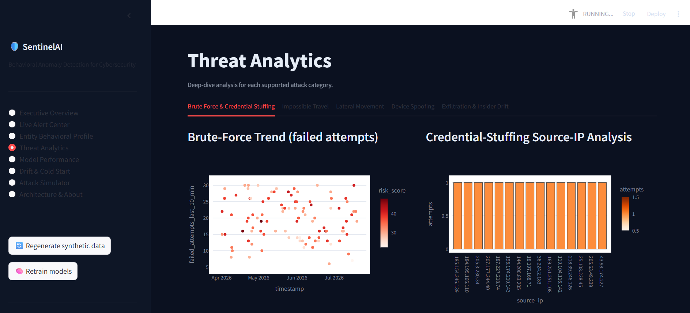
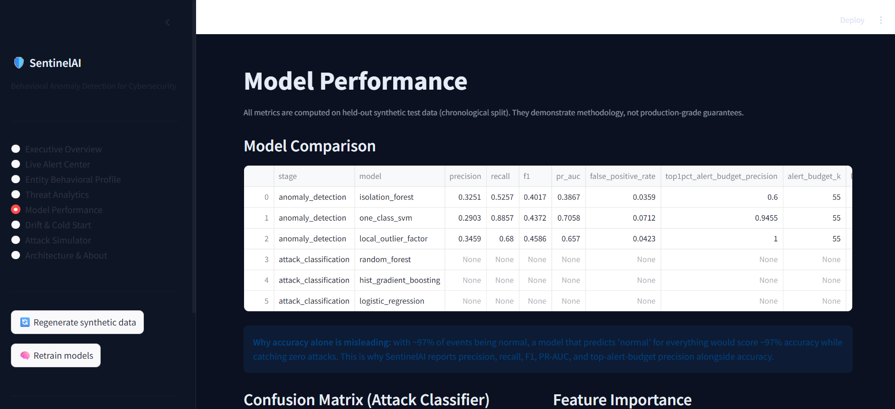

# SentinelAI - AI-Powered Behavioral Anomaly Detection for Cybersecurity

> **Hackathon prototype.** All data in this project is **synthetically generated**. Metrics and
> results reflect performance on synthetic test data only and are **not** claims of production
> accuracy.

## Problem Statement

Design an AI/ML system that learns the normal access and connection behavior of users, service
accounts, and devices; detects suspicious behavior in near real time; classifies the probable
anomaly type; generates an explainable risk score; and provides an analyst-facing dashboard -
while addressing sequential/behavioral data, extreme class imbalance, concept drift,
explainability, cold-start entities, and real-time streaming feasibility.

## Key Features

- **Synthetic behavioral dataset**: 22,000 access events across 150 users, 20 service accounts,
  and 30 devices, each with its own baseline behavior profile, plus 7 injected attack patterns.
- **Two-stage hybrid ML pipeline**: unsupervised anomaly detection (Isolation Forest, primary)
  followed by supervised attack-type classification (Random Forest, primary), with additional
  baseline models trained for comparison.
- **Explainable 0-100 risk score** built from a transparent, weighted combination of behavioral
  signals - not a black box.
- **Rule-based explainability engine** that generates a plain-language narrative and top
  contributing factors for every alert.
- **Concept-drift monitor** using Population Stability Index (PSI) between historical and recent
  data windows.
- **Cold-start handling** for entities with limited history, with reduced confidence and a
  trusted-observation-window policy before baselines are updated.
- **8-page Streamlit SOC dashboard**: Executive Overview, Live Alert Center, Entity Behavioral
  Profile, Threat Analytics, Model Performance, Drift & Cold Start, Attack Simulator, and
  Architecture & About.

## System Architecture

```
Synthetic Access Log Generator
        |
Data Validation and Preprocessing
        |
Feature Engineering
        |
Per-Entity Behavioral Baselines
        |
Anomaly Detection Model (Isolation Forest)
        |
Attack-Type Classifier (Random Forest)
        |
Risk and Explainability Engine
        |
Concept Drift Monitor
        |
Streamlit SOC Dashboard
```

Additional components: model artifacts (`models/`), historical entity-profile storage
(`data/entity_baselines.json`), an analyst feedback loop (planned future extension), and a
real-time deployment extension path (batch -> micro-batch -> streaming).

## Technology Stack

- Python 3
- Streamlit (dashboard)
- Pandas, NumPy (data processing)
- Faker (synthetic data generation)
- Scikit-learn (Isolation Forest, One-Class SVM, Local Outlier Factor, Random Forest,
  HistGradientBoosting, Logistic Regression)
- Plotly, Matplotlib (visualization)
- Joblib (model persistence)
- python-pptx (presentation generation)

No React, Node.js, Docker, Kafka, cloud services, or paid APIs are used.

## Installation

```bash
pip install -r requirements.txt
```

## How to Generate Data

```bash
python generate_data.py
```

Creates `data/synthetic_access_logs.csv`, `data/train_data.csv`, `data/test_data.csv`, and
`data/entity_baselines.json`.

## How to Train Models

```bash
python train_models.py
```

Creates model artifacts in `models/` and evaluation outputs in `outputs/`.

## How to Run the Dashboard

```bash
streamlit run app.py
```

The app automatically generates data and trains models on first run if the artifacts are
missing, and provides "Regenerate data" / "Retrain models" buttons in the sidebar.

## Folder Structure

```
sentinel-ai/
├── app.py                     Streamlit dashboard (all 8 pages)
├── generate_data.py           Synthetic dataset generator
├── train_models.py            Model training + evaluation
├── utils.py                   Shared feature engineering & helpers
├── explainability.py          Rule-based explanation engine
├── drift_detection.py         PSI-based concept-drift + cold-start logic
├── risk_engine.py             Deterministic 0-100 risk scoring
├── requirements.txt
├── README.md
├── data/                      Generated synthetic CSVs + entity baselines
├── models/                    Trained model artifacts (.pkl)
├── outputs/                   Evaluation metrics, charts
├── presentation/               6-slide hackathon PPTX (+ PDF if available)
└── report/                    Full project report (Markdown)
```

## Model Methodology

**Stage A (unsupervised):** Isolation Forest is the primary anomaly detector because it is fast,
requires no labeled data, and handles high-dimensional tabular data well. One-Class SVM and Local
Outlier Factor are trained on the same features as comparison baselines (see
`outputs/model_comparison.csv`).

**Stage B (supervised):** Random Forest, HistGradientBoosting, and Logistic Regression are trained
with class weighting on all 8 classes (`normal` + 7 attack types). The model with the best macro
F1 on the held-out chronological test split is selected automatically.

**Chronological split:** Training and test sets are split by timestamp (not randomly shuffled) to
approximate a realistic "train on the past, evaluate on the future" scenario and reduce leakage.

**Label leakage prevention:** `anomaly_label` and `attack_type` are used only as training targets
and are never included as input features.

## Evaluation Metrics

See `outputs/evaluation_metrics.csv` and `outputs/model_comparison.csv` for the full breakdown,
and the **Model Performance** page in the dashboard for a visual summary. Metrics reported include
precision, recall, F1, PR-AUC, false-positive rate, and top-1%-alert-budget precision for anomaly
detection, and accuracy, macro/weighted F1, and per-class metrics for attack classification.

**Note:** because ~97% of events are normal, overall accuracy alone is a misleading metric for this
problem - the dashboard deliberately surfaces precision/recall/F1 and alert-budget precision
alongside it.

## Screenshots

## Executive Overview


### Live Alert Center


### Entity Behavioral Profile


### Threat Analytics


### Model Performance


## Limitations

- Trained entirely on synthetic data; real-world traffic distributions, volumes, and attacker
  behavior will differ.
- Risk-score weights are heuristic and chosen for interpretability, not statistically optimized
  against a labeled production dataset.
- No true real-time streaming (Kafka/Flink); the MVP scores events on-demand / in near-real-time
  rather than via a continuous stream.
- Explainability is rule-based rather than SHAP-based, to keep the hackathon build fast, dependency
  -light, and stable.
- Single-node prototype; has not been load-tested at enterprise scale.

## Future Scope

- Integrate a real streaming pipeline (Kafka/Flink) for continuous scoring.
- Add SHAP-based explainability once runtime/dependency constraints allow.
- Add analyst feedback loops so confirmed true/false positives retrain the models.
- Expand lateral-movement detection with entity/resource graph analysis.
- Validate against real, anonymized SOC datasets before any production consideration.

## Team

- **Bhawna Chaurasia**

## License

This is a hackathon prototype provided for demonstration purposes. No license is implied for
production or commercial use without further review.
